# 🛍️ ShopZen - Flutter eCommerce App

Welcome to **ShopZen**, a modern and responsive Flutter eCommerce application designed to deliver a smooth and intuitive shopping experience. Built using **Flutter** with **Supabase**, **BLoC**, and *Clean Architecture principles*, ShopZen is tailored for both developers and users who value performance and design.

---

## 🚀 Features

* 🔐 Firebase Authentication (Email + Password)
* 🛒 Product browsing with dynamic categories
* ❤️ Wishlist / Saved Items
* 🧺 Cart Management with real-time total calculation
* 📦 Order flow simulation (Add to cart → Checkout)
* 🎨 Light/Dark Theme Switch
* 🌍 Multi-language support (English & Arabic)
* 🔔 Toast and snackbar notifications
* 💾 Caching using SharedPreferences

---

## 📸 Screenshots

| Splash Screen                        | Onboarding                          | Sign In                            | Sign Up                            |
|-------------------------------------|-------------------------------------|------------------------------------|------------------------------------|
| 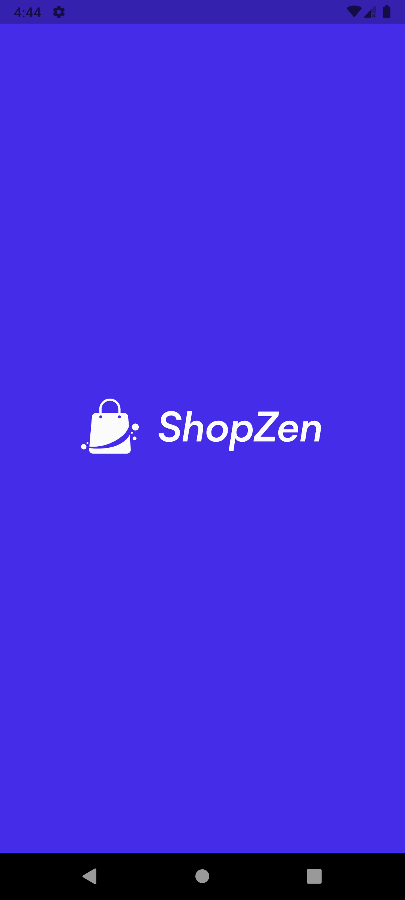 | 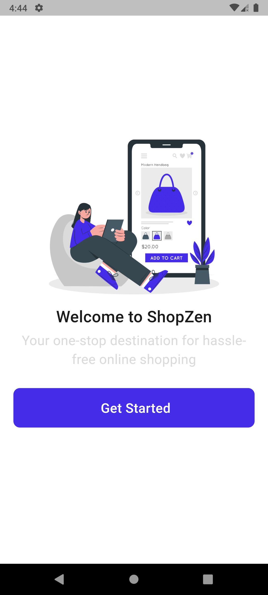 | 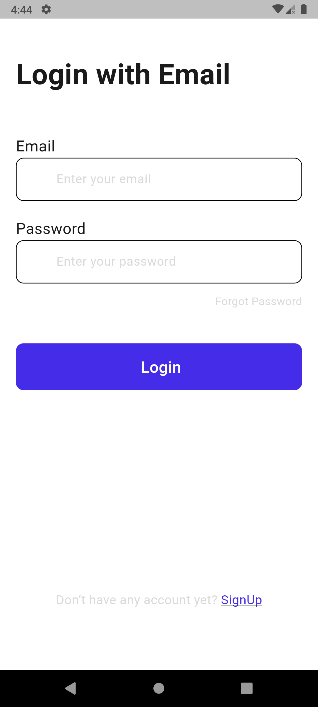 | 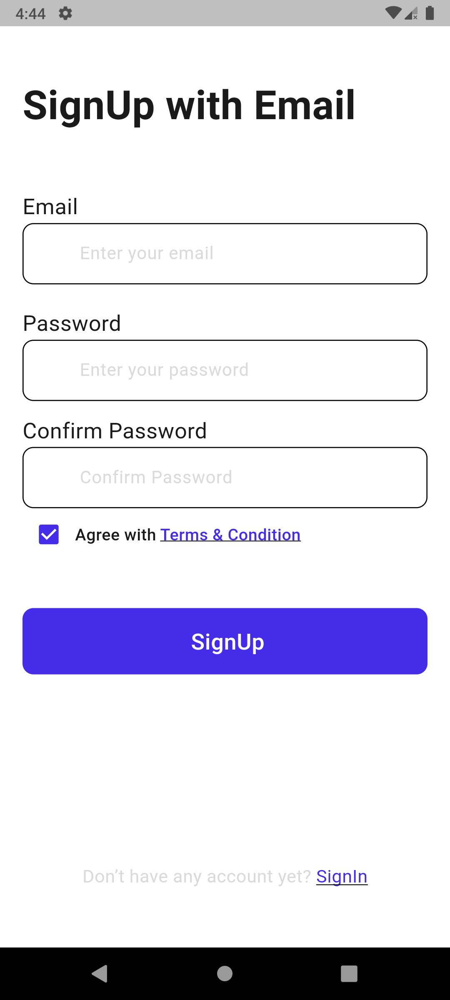 |

| Home                                | View All Products                   | Product Details                    | Cart                               |
|-------------------------------------|-------------------------------------|------------------------------------|------------------------------------|
| 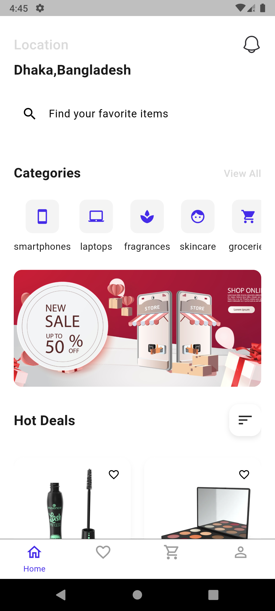   | 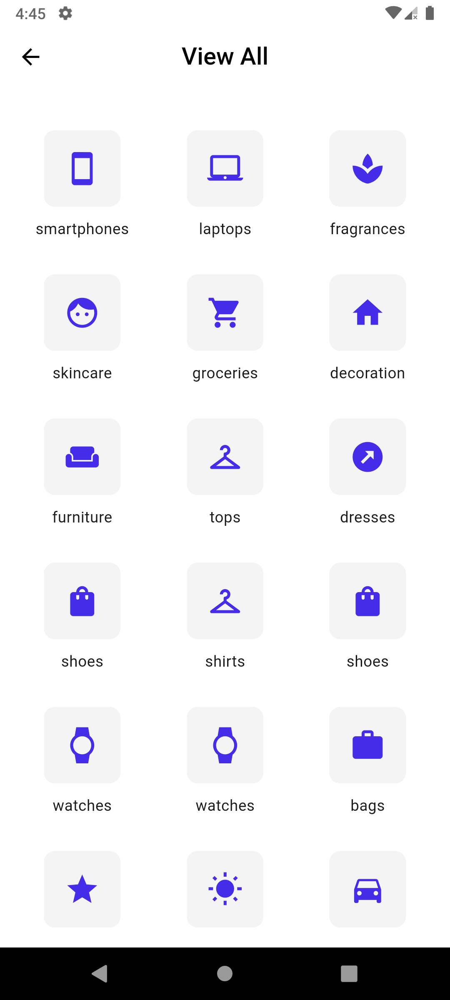 | 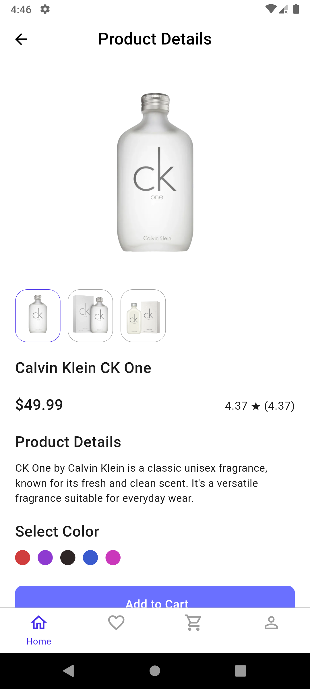 | 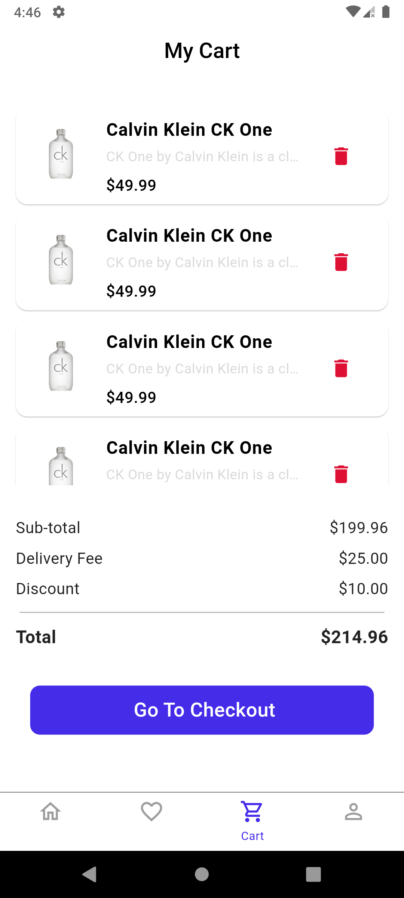 |

| Checkout                            | Saved Items                         | Search                             | Account (EN)                       |
|-------------------------------------|-------------------------------------|------------------------------------|------------------------------------|
| 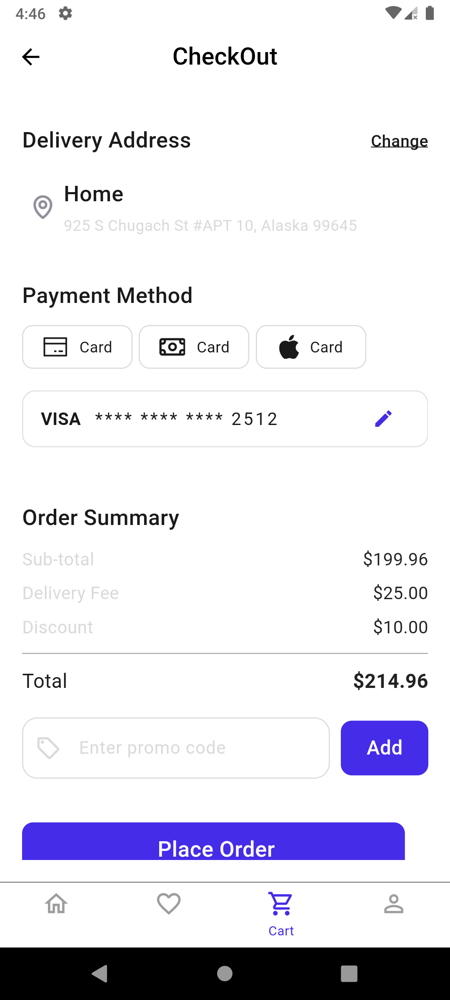 |  | 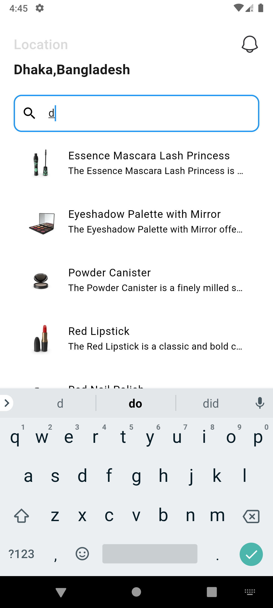 | 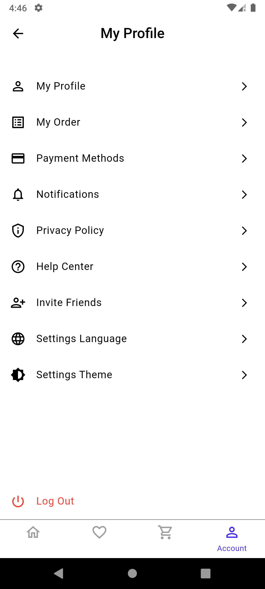 |

| Account (AR)                        |
|-------------------------------------|
| 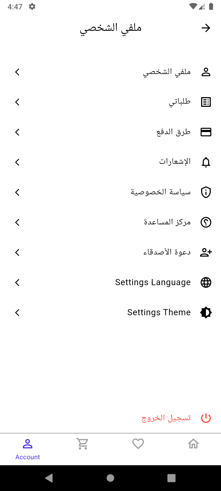 |


> 📁 You can add your screenshots in the `/screenshots` folder.

---

## 🧩 Tech Stack

* **Flutter** (Latest Stable)
* **Firebase Auth**
* **Supabase** (for data)
* **BLoC** for State Management
* **GoRouter** for Routing
* **SharedPreferences** for Local Storage
* **Flutter SVG** + **Cached Network Image** for Media Handling

---

## 🛠️ Installation & Run Locally

### Prerequisites:

* Flutter SDK (>=3.10.0)
* Dart SDK (comes with Flutter)
* Git

### Steps:

```bash
# 1. Clone the repository
$ git clone https://github.com/Abdelrhman-Tec/ShopZen.git
$ cd ShopZen

# 2. Install dependencies
$ flutter pub get

# 3. Run on connected device or emulator
$ flutter run
```

---

## 📁 Project Structure

```
lib/
├── config/
│   ├── routes/              # GoRouter setup
│   ├── cache/               # SharedPreferences helper
│   └── theme/               # Theme & language cubits
├── core/                   # App-level shared components (colors, widgets, etc.)
├── features/
│   ├── auth/               # Sign In / Sign Up / Cubit
│   ├── home/               # Home screen & product listing
│   ├── cart/               # Cart logic
│   └── saved_items/        # Wishlist logic
├── main.dart               # Entry point
```

---

## 🔧 Execution Plan

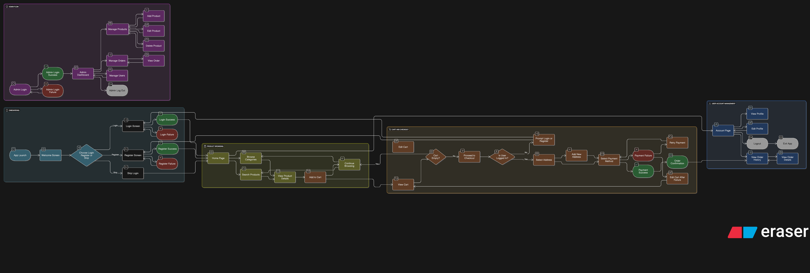

## 🤝 Contribution

Pull requests are welcome. For major changes, please open an issue first to discuss what you would like to change.

---

## 📄 License

MIT License. See `LICENSE` file.

---

Made with ❤️ by [Abdelrhman Nada](https://github.com/Abdelrhman-Tec)
